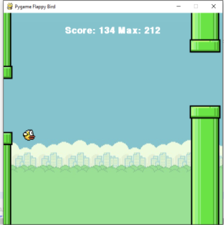

# Q Learning
 Q-Learning is form a reinforcement learning that does not require the agents to have prior knowledge of the environment dynamics. This projects aims at building a Flappy Bird agent. The main idea is to make the bird learn by making mistakes and score higher by using Q-Learning to learn the best action to be performed at the right position. The only action choices for the bird are : flap wings or do nothing. The main objective is to survive for as long as possible. The bird moves at a constant horizontal speed but its vertical velocity is controlled by its flapping. 

  

 ## Pre-requistes
 Install the pygame module for the python interpreter.  
 `pip install pygame`

## Run the program 
The file used in the program is q_values_train_v2_set.txt. With this as an input, it generates three other files after the game : q_values_train_v2_set.txt, avgScore_v2_set.txt and Score_v2_set.txt. 

Here is an example of how to run the program :  
`python flappy_bird_q_learning.py`

## References
- Applying Q-Learning to Flappy Bird: Moritz Ebeling-Rump, Manfred Kao, Zachary Hervieux-Moore
- https://en.wikipedia.org/wiki/Q-learning

